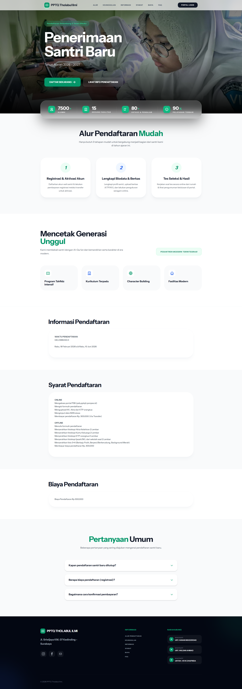
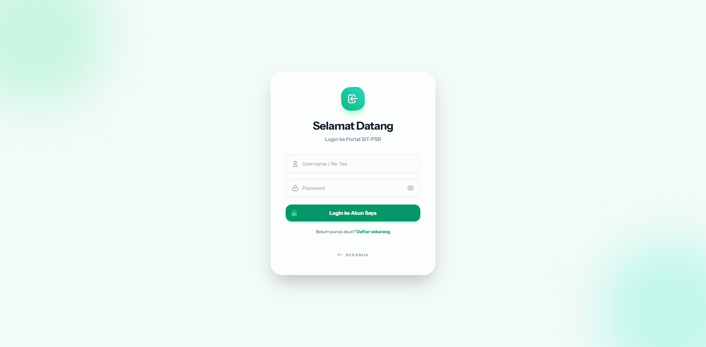
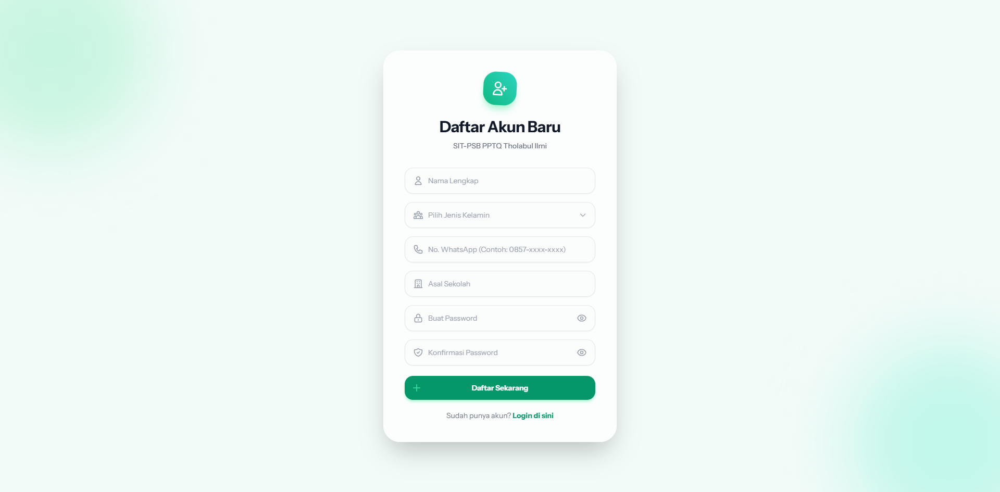
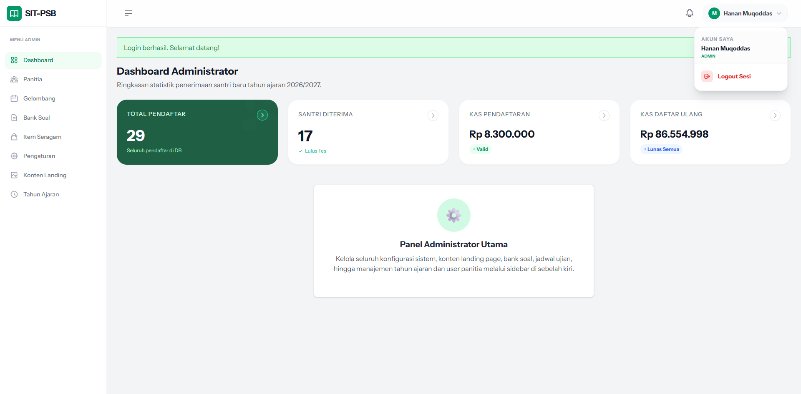
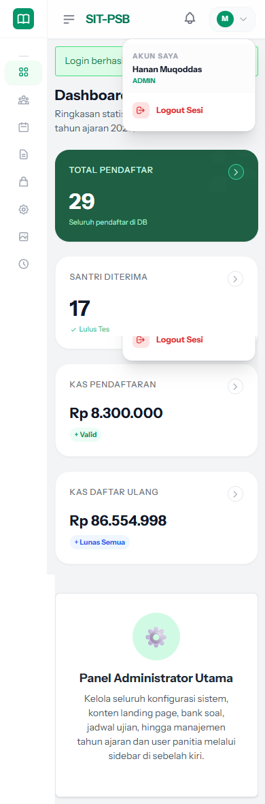
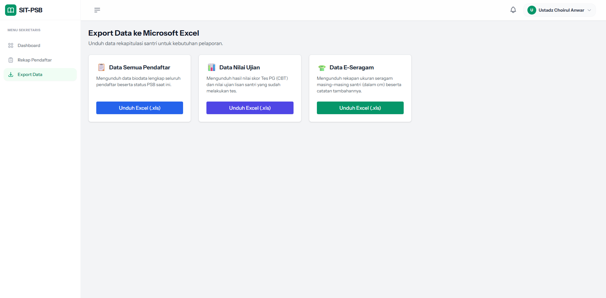
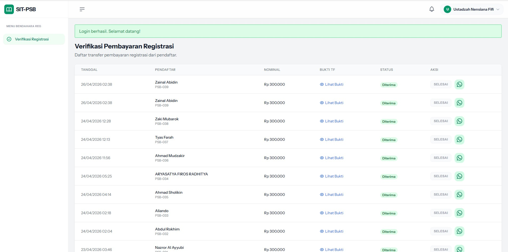
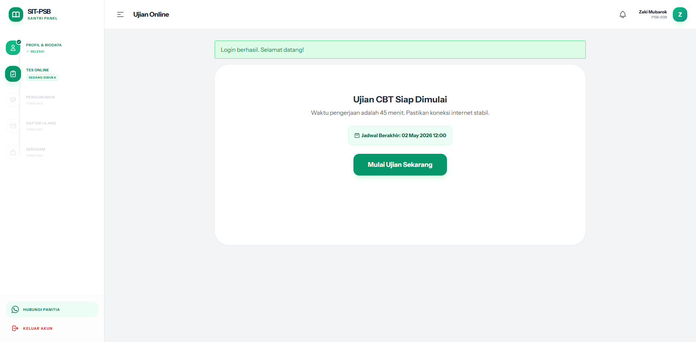
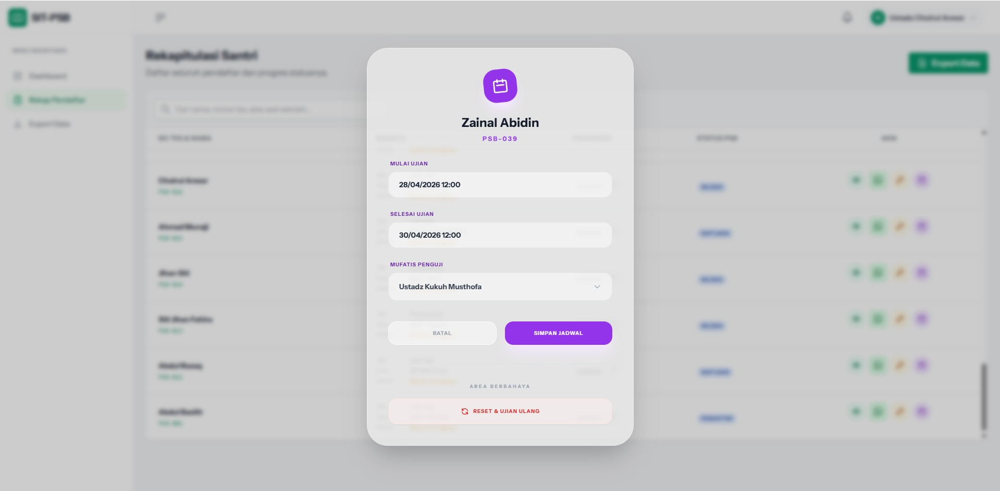

# SIT-PSB (Sistem Informasi Terpadu - Penerimaan Santri Baru)

Aplikasi web untuk manajemen penerimaan santri baru dengan fitur CBT (Computer Based Test) terintegrasi, manajemen biodata, dan pembayaran.

## Fitur Utama
- **Dashboard Admin & Panitia**: Monitoring pendaftaran, verifikasi pembayaran, dan statistik.
- **Portal Santri**: Pengisian biodata, upload berkas, dan pengerjaan soal CBT.
- **Ujian CBT**: Tes Pilihan Ganda dan Tes Lisan (Hafalan) dengan integrasi audio recording.
- **PWA (Progressive Web App)**: Bisa diinstal di HP dan mendukung notifikasi (Web Push).
- **Notifikasi Terintegrasi**: Menggunakan sistem notifikasi internal dan Push Notification.
- **Optimasi Mobile**: Desain responsif menggunakan Tailwind CSS.

## Preview Tampilan

### Halaman Publik

  

  
  

### Panel Admin & Panitia

  
  

  
  

### Portal Santri & Ujian

  
  

## Teknologi yang Digunakan
- **Backend**: PHP (MVC Architecture)
- **Database**: MySQL (PDO)
- **Frontend**: Tailwind CSS, Alpine.js, SweetAlert2
- **Integrasi**: API e-Quran (untuk tes hafalan)

## Instalasi
1. Clone repositori ini.
2. Import database `db_sit_psb.sql` (jika tersedia secara terpisah).
3. Sesuaikan konfigurasi database di `config/database.php`.
4. Jalankan `composer install` untuk menginstal dependensi.
5. Akses melalui web server (seperti Laragon atau Apache).

## Keamanan
Proyek ini telah melalui audit keamanan dasar, termasuk:
- Proteksi SQL Injection (Prepared Statements).
- Proteksi CSRF.
- Sanitasi Input (XSS Prevention).
- Rate Limiting pada sistem login.
- Security Headers pada `.htaccess`.

---
*Proyek ini dikembangkan untuk kebutuhan internal Pondok Pesantren.*
